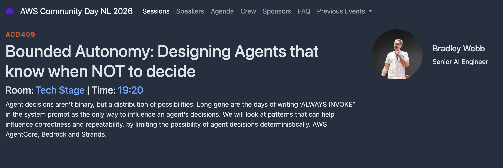

# Bounded Autonomy

Talk material for [AWS Community Day NL 2026](https://awscommunityday.nl/2026/) — **23 Sep 2026**, Kinepolis Jaarbeurs Utrecht.

[](https://awscommunityday.nl/2026/sessions/acd409/)


Agent decisions aren’t binary, but a distribution of possibilities. Long gone are the days of writing “ALWAYS INVOKE” in the system prompt as the only way to influence an agent’s decisions. This repo is the live demo for patterns that limit those decisions deterministically — AgentCore, Bedrock, and Strands.

**Thesis:** Building agents with deterministic ideas can narrow the bounds of decision for agents, with very little cost of tokens and compute.

This repo is the live demo: one [Amazon Bedrock AgentCore](https://docs.aws.amazon.com/bedrock-agentcore/latest/devguide/what-is-bedrock-agentcore.html) runtime in **eu-west-1**, agents in [Strands](https://strandsagents.com/), ten order-reconciliation jobs in `samples/items.json`. Same list, different execution strategies. You measure **wall clock**, **tokens**, and **how many jobs actually ran**.

In Strands, a Graph with one node per item is the explicit map: pass a list of 10 jobs, you should see 10 executions. The question is what that costs, and what you save by making the fan-out a Python or Graph decision instead of a hope.

## On stage

Default model: `eu.amazon.nova-lite-v1:0`. Region: `eu-west-1`.

Each job is a small order. The work is: recompute `qty * unit_eur`, apply `discount_pct`, compare to `claimed_total_eur`, then `accept` / `hold` / `review` / `reject`. Walk through **job-03** if you need a concrete row: lines total **25 EUR**, claimed **40 EUR** → `reject` / `TOTAL_MISMATCH`.

### 1. Dump the list, hope

| Approach | What you run | What to point at |
| --- | --- | --- |
| `raw_batch` | One Strands agent, whole JSON list in the user prompt | `items` often under `10/10`. One execution |

### 2. Explicit map (compute)

| Approach | What you run | What to point at |
| --- | --- | --- |
| `for_loop` | `for item in items:` — new agent per job, sequential | `executions = 10`. Wall clock ≈ **sum** of 10 |
| `subagents` | Strands Graph, one node per job, parallel | `executions = 10`. Wall clock ≈ **slowest** of 10 |

### 3. Tools vs functions (decision bounds)

Not in the system prompt. Optional on stage with `--extra`.

| Approach | What you run | What to point at |
| --- | --- | --- |
| `agent_tools` | `tools=[evaluate_item]`; user prompt is the JSON list | Model chooses whether to call the tool |
| `prompted_tools` | Same tool; user message is `evaluate_item(...)` lines | Model still has to emit `tool_use` |
| `user_prompt_exec` | Python parses those lines and runs them | Model only formats. Policy is already decided |
| `direct_tool` | `agent.tool.evaluate_item(...)` from code | `tokens ≈ 0`. Same `@tool`, no routing |

job-03 through `direct_tool` is always `expected_total_eur: 25.0`, `decision: reject`.

## Execute

Needs Node 20+, Python 3.12+, Docker with buildx (ARM64), CDK v2, credentials, and Bedrock access for Nova Lite in **eu-west-1**.

### Deploy (once)

```bash
npm install
npx cdk bootstrap aws://ACCOUNT/eu-west-1
npx cdk deploy
```

Copy `AgentRuntimeArn` from the outputs.

```bash
export AWS_REGION=eu-west-1
export AGENT_RUNTIME_ARN='arn:aws:bedrock-agentcore:eu-west-1:ACCOUNT:runtime/boundedAutonomy-...'
```

### Live bench

Warmup is discarded so cold start does not land on `raw_batch`.

```bash
python3 scripts/bench.py
```

Expected table shape (numbers move; the shape is the slide):

```
approach     ms       tokens   executions  items
----------   ------   ------   ----------  -----
raw_batch    lower    lower    1           8/10 or 10/10
for_loop     highest  ~10×     10          10/10
subagents    ~1× max  ~10×     10          10/10

Compute ratio for_loop / subagents: Nx wall clock
raw_batch covered 8/10 ids
Wrote bench-results.json
```

```bash
python3 scripts/bench.py --extra
```

Adds `agent_tools`, `prompted_tools`, `user_prompt_exec`. For a guaranteed Python reject on job-03:

```bash
python3 scripts/invoke.py --approach direct_tool
```

One Graph run:

```bash
python3 scripts/invoke.py --approach subagents
```

Payload if you invoke the runtime yourself (omit `items` to use the built-in ten):

```json
{ "approach": "subagents", "items": [ { "id": "job-03", "...": "..." } ] }
```

Approaches: `raw_batch` | `for_loop` | `subagents` | `direct_tool` | `agent_tools` | `prompted_tools` | `user_prompt_exec` | `compare`.

`compare` runs the three bench approaches in one request. Prefer `scripts/bench.py` on stage so each row is timed separately.

### Local (no CDK)

```bash
cd agent
python3 -m venv .venv
source .venv/bin/activate
pip install -r requirements.txt
MODEL_ID=eu.amazon.nova-lite-v1:0 python -m main
```

```bash
curl -s localhost:8080/invocations \
  -H 'Content-Type: application/json' \
  -d '{"approach":"direct_tool"}'
```

Responses include `"framework": "strands"`.

### Policy only (no Bedrock)

```bash
pip install -r requirements-dev.txt
python3 -m pytest tests/ -q
```

## Layout

```
lib/bounded-autonomy-stack.ts   AgentCore runtime, eu-west-1, Nova Lite
agent/main.py                   AgentCore host; Strands is the framework
agent/approaches/               the strategies above
agent/domain/policy.py          the deterministic reconcile
samples/items.json              ten jobs
scripts/bench.py                stage table
scripts/invoke.py               one approach, full JSON
```

## Cleanup

```bash
npx cdk destroy
```
